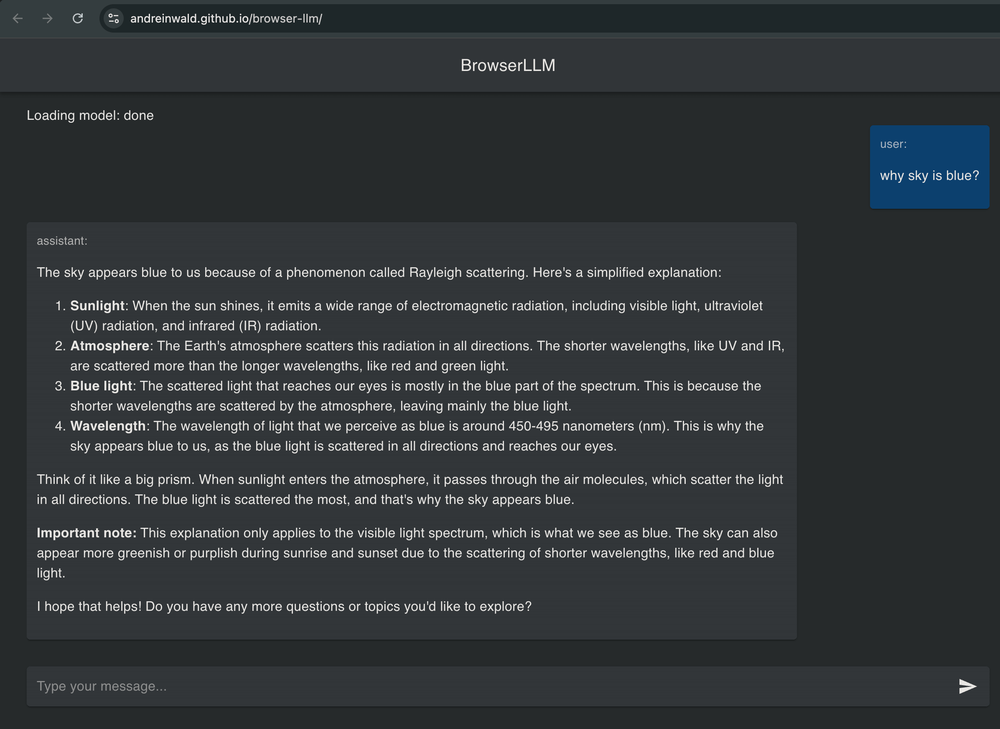

# Browser LLM demo working on JavaScript and WebGPU

WebGPU is already supported in Chrome, Safari, Firefox, iOS (v26) and Android ([check](https://webgpureport.org))

**Demo, similar to ChatGPT** https://andreinwald.github.io/browser-llm/

HackerNews discussion https://news.ycombinator.com/item?id=44767775

- No need to use your OPENAI_API_KEY - its local model that runs on your device
- No network requests to any API
- No need to install any program
- No need to download files on your device (model is cached in browser)
- Site will ask before downloading large files (llm model) to browser cache
- Hosted on Github Pages from this repo - secure, because you see what you are running
- Default model: Llama-3.2-1B
